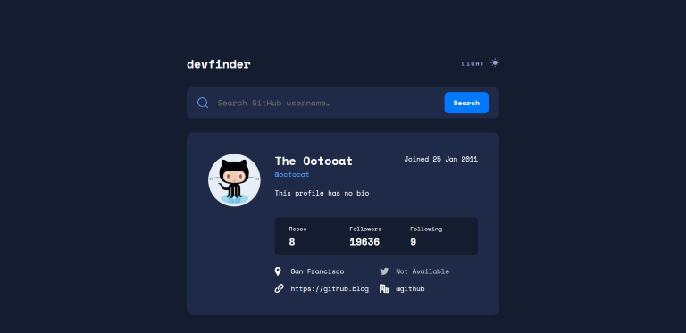

# Frontend Mentor - GitHub user search app solution

This is a solution to the [GitHub user search app challenge on Frontend Mentor](https://www.frontendmentor.io/challenges/github-user-search-app-Q09YOgaH6). Frontend Mentor challenges help you improve your coding skills by building realistic projects.

## Table of contents

- [Overview](#overview)
  - [The challenge](#the-challenge)
  - [Screenshot](#screenshot)
  - [Links](#links)
- [My process](#my-process)
  - [Built with](#built-with)
  - [What I learned](#what-i-learned)
  - [Continued development](#continued-development)
- [Author](#author)

## Overview

### The challenge

Users should be able to:

- View the optimal layout for the app depending on their device's screen size
- See hover states for all interactive elements on the page
- Search for GitHub users by their username
- See relevant user information based on their search
- Switch between light and dark themes
- **Bonus**: Have the correct color scheme chosen for them based on their computer preferences. _Hint_: Research `prefers-color-scheme` in CSS.

### Screenshot

### Links

- Solution URL: [Solution](https://github.com/socratesioa/github-search-app)
- Live Site URL: [Live Site](https://github-search-app-socrates.netlify.app/)

## My process

### Built with

- Semantic HTML5 markup
- CSS custom properties
- Flexbox
- CSS Grid
- Mobile-first workflow
- JavaScript
- Sass/SCSS
- Netlify functions

### What I learned

Most of the project was straight forward. Having done a few projects using JSON data, populating the DOM using that data wasn't difficult. My biggest challenge here was dealing with backend and hiding the github token. This was great as I got the chance to deploy the website using Netlify which I hadn't done before. I knew how to do the exact same process using node.js but since I didn't want to use a VPS, Netlify was a great option.

Another thing I learned with this project was using JavaScript to display the mode the user has set in the OS settings.

### Continued development

I plan to work on more JSON and API projects to build more confidence in those.

## Author

- Website - [My Portfolio](https://portfolio.thisissocrates.com/)
- Frontend Mentor - [@socratesioa](https://www.frontendmentor.io/profile/socratesioa)
